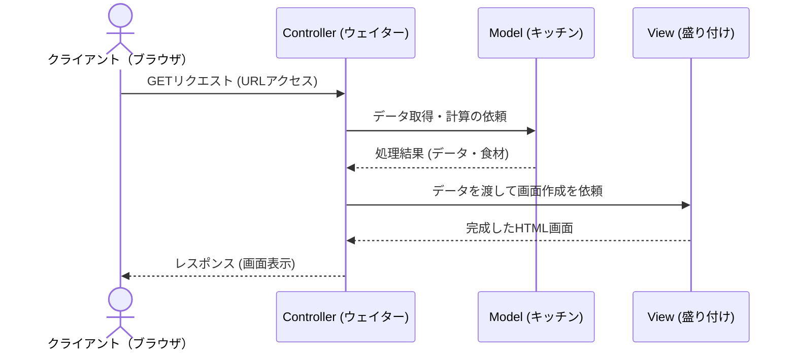

# 第3章：Webアプリケーションの基本とMVCアーキテクチャ

私たちが普段使っているWebサイトや社内システムは、裏側でどのように動いているのでしょうか。そして、プログラムを分かりやすく整理・分業するための「MVC」という設計手法について学びます。

## この章でできるようになること

- リクエストとレスポンスの基本フローを言語化できる
- MVCの各役割（Model / View / Controller）を具体的な処理に割り当てられる
- 「修正しやすい構造」を役割分離の観点で説明できる

## 1. Webの仕組み（リクエストとレスポンス）

Webアプリケーションは、基本的に **「クライアント」** と **「サーバー」** のキャッチボールで成り立っています。

- **クライアント（Webブラウザやスマホアプリ）**  
  ユーザーが操作する側です。「このページを見せて！」「このデータを登録して！」というお願いをサーバーに送ります。このお願いを **「リクエスト」** と呼びます。
- **サーバー（Javaが動いているコンピュータ）**  
  お願いを受け取り、必要なデータを探したり計算したりして、「はい、どうぞ」と結果（HTMLの画面やデータ）を返します。この返事を **「レスポンス」** と呼びます。

システム開発の仕事は、主にこの **「サーバー側でリクエストを受け取り、レスポンスを返すまでの処理」** を作ることです。

## 2. なぜ「分ける」必要があるのか？（悪い例）

リクエストを受け取ってからレスポンスを返すまでには、「入力されたデータが正しいかチェックする」「データベース（DB）から情報を探す」「消費税を計算する」「見栄えの良いHTML画面を組み立てる」など、たくさんの作業があります。

これらを**1つの巨大なファイル（クラス）に全部書いてしまうこと**を想像してください。

**【悪い例：すべてを1つの場所でやってしまう悲劇】**

- **問題1：解読不能になる**  
  「画面のHTMLタグ」と「DBに接続する複雑なコード」と「計算ロジック」が入り乱れ、数千行のコードになります。後から読んでも何をしているのか分かりません。
- **問題2：修正が怖い**  
  「画面のボタンの色を変えたいだけ」なのに、間違って「消費税の計算ロジック」を消してしまい、システム全体がバグる危険性があります。
- **問題3：チームで分業できない**  
  「Aさんは画面を作り、Bさんは計算処理を作る」という分業ができません。同じファイルを2人で同時に編集すると、後で合体させる時に大混乱になります。

## 3. MVCアーキテクチャとは？（役割分担の魔法）

上記のような悲劇を防ぐため、処理の役割を明確に **「Model（モデル）」「View（ビュー）」「Controller（コントローラー）」** の3つの部屋（ファイル・クラス）に分ける設計ルールが生まれました。これが **MVC** です。

レストランに例えると非常にわかりやすいです。

- **Controller（コントローラー） ＝ ウェイター（進行役）**  
  クライアントからの注文（リクエスト）を一番最初に受け取ります。自分では料理（複雑な処理）はせず、「キッチン（Model）」に「カレー1つ！」と注文を伝えます。そして、出来上がった料理を「盛り付け担当（View）」に渡してお客様に出す（レスポンス）という、全体の交通整理を行います。
- **Model（モデル） ＝ キッチン（料理人・食材）**  
  システムの「心臓部（ビジネスロジック）」です。ウェイターから言われた通りに、データベースから食材（データ）を取ってきたり、金額の計算（調理）を行ったりします。画面がどうなっているかは一切知りません。
- **View（ビュー） ＝ 盛り付け・配膳担当（画面）**  
  キッチンから上がってきたデータ（料理）を、ユーザーが見やすい形（HTMLなどの画面）に綺麗に整えて表示する役割です。裏側でどうやって計算されたかは知りません。

**【良い例：MVCで分けた場合のメリット】**

- 「画面のデザインを変えたい」 ➔ **Viewだけ** を修正すればよい（Modelを壊す心配がない）。
- 「消費税率が変わった」 ➔ **Modelだけ** を修正すればよい（画面に影響しない）。
- 「AさんはView担当、BさんはModel担当」と、ファイルが分かれているので **安全に分業できる** 。

これが「関心の分離（自分の役割だけに関心を持つ）」と呼ばれる、現代のシステム開発において最も重要な考え方です。

#### シーケンス図：MVCのキャッチボール



---

### 【サンプルコード】JavaでMVCを表現してみる

Spring Bootで本格的なWebアプリを作る前に、「役割を分ける」という感覚をシンプルなJavaプログラムで体感してみましょう。以下の4つのファイルが連携して動きます。

**1. Model（データと計算の役割）: `User.java`**

```java
// ユーザーのデータと、年齢に関する計算（ビジネスロジック）を持つ
public class User {
    private String name;
    private int birthYear;

    public User(String name, int birthYear) {
        this.name = name;
        this.birthYear = birthYear;
    }

    public String getName() { return this.name; }

    // 現在の年齢を計算する「Model」の役割
    public int calculateAge(int currentYear) {
        return currentYear - this.birthYear;
    }
}
```

**2. View（見た目を作る役割）: `UserView.java`**

```java
// データをもらって、どう綺麗に表示するかだけを知っている
public class UserView {
    public void printUserDetails(String userName, int age) {
        System.out.println("====================");
        System.out.println("【会員プロフィール】");
        System.out.println("お名前: " + userName + " 様");
        System.out.println("ご年齢: " + age + " 歳");
        System.out.println("====================");
    }
}
```

**3. Controller（進行役）: `UserController.java`**

```java
// クライアントからの要求を受け取り、ModelとViewを繋ぐウェイター
public class UserController {
    private User model;
    private UserView view;

    public UserController(User model, UserView view) {
        this.model = model;
        this.view = view;
    }

    // 「プロフィール画面を表示しろ！」というリクエストが来た時の処理
    public void showProfile() {
        // 1. Modelからデータをもらい、年齢を計算させる
        String name = model.getName();
        int age = model.calculateAge(2026); // 2026年時点の年齢

        // 2. 計算結果をViewに渡して、画面を表示させる
        view.printUserDetails(name, age);
    }
}
```

**4. 実行用（クライアントの代わり）: `Main.java`**

```java
public class Main {
    public static void main(String[] args) {
        // 準備：ModelとViewを用意する
        User model = new User("鈴木一郎", 1990);
        UserView view = new UserView();

        // 準備：Controller（進行役）にModelとViewを任せる
        UserController controller = new UserController(model, view);

        // ★実行：クライアントが「プロフィールを見せて！」とリクエストを送った想定
        controller.showProfile();
    }
}
```

---

## 確証をとるためのテスト（第3章）

ここからは、あなたが MVC の「なぜ分けるのか（メリット）」と「それぞれの役割」を説明できるかを確認するセルフチェックです。

**【例題1：役割の仕分け】**  
あなたがオンラインショップのシステムを開発しているとします。以下の処理は、MVCのどれ（Model, View, Controllerのどれか）に担当させるのが適切ですか？理由も合わせて答えてください。

1.  「購入ボタン」が押された時、そのリクエストを最初に受け取る。
2.  商品の価格に消費税と送料を足して、合計金額を計算する。
3.  計算された合計金額を、赤字の太字で画面に表示するためのHTMLを組み立てる。

**【例題2：MVCのメリット（トラブル対応）】**  
「ログイン画面のパスワード入力欄の幅を少し広くしてほしい」という修正依頼と、「パスワードの暗号化のルールをより強固なものに変更してほしい」という修正依頼が同時に来ました。
MVCで設計されたシステムの場合、それぞれどの部分（M, V, C）を修正すれば良いでしょうか。また、それらを同時に別のプログラマーが作業できるのはなぜですか？

## <Next Step>

MVCの次に押さえると、Web開発の理解が一段上がるテーマです。

- **HTTPメソッドとステータスコード**：`GET/POST/PUT/DELETE` と `200/400/500` の意味整理
- **REST設計の基本**：URL設計とリソース指向の考え方
- **セッション / Cookie / JWT**：認証・認可まわりの土台知識
- **バリデーション**：入力値の妥当性をどこで保証するか（ControllerとServiceの責務分離）

検索キーワードの一覧は[第7章](07_next-step-keywords.md)を使ってください。

---

← [第2章に戻る](02_oop-fundamentals.md)  |  → [第4章へ進む](04_di-and-annotations.md)
