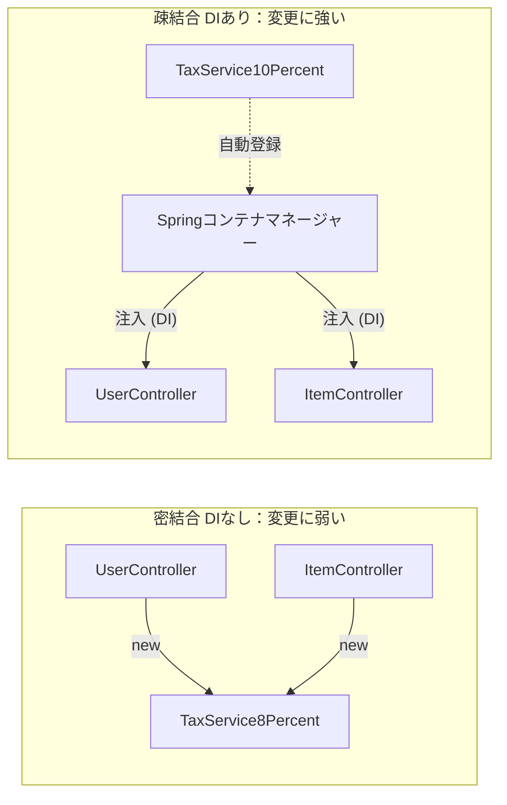

# 第4章：Spring Bootの全体像と中核概念（DI・IoC・アノテーション）

JavaとMVCの基本が分かったところで、いよいよ現場で使う武器「Spring Boot」の正体に迫ります。
Spring Bootを学ぶ初心者の9割が、この章で解説する **「DI（依存性の注入：Dependency Injection）」** という言葉でつまずきます。しかし、ここを腹落ちさせることができれば、Spring Bootの理解は半分終わったようなものです。

## この章でできるようになること

- DIとIoCの違いを、`new` を使う実装と比較して説明できる
- アノテーションがSpringコンテナで果たす役割を理解できる
- 仕様変更時に「どこを直すべきか」を疎結合の観点で判断できる

## 0. Spring Bootとは何か？（自動構成という魔法）

### フレームワークの役割

「Spring」は、Javaで本格的なWebアプリケーションを開発するための**フレームワーク**です。フレームワークとは、アプリを作るための「土台・骨組み」を提供してくれる道具一式のことです。セキュリティ対策・データベース接続・Web通信処理など、どんなシステムでも必要になる共通の仕組みがあらかじめ用意されています。

そして **「Spring Boot」は、このSpringの複雑なセットアップを劇的に簡単にした、便利なパッケージ版** です。

### 自動構成（Auto-configuration）

Spring Boot最大の特徴が **「自動構成（Auto-configuration）」** です。従来のSpringでは、どのクラスをどのように動かすかを何百行もの設定ファイル（XMLなど）に書く必要がありました。Spring Bootは「このライブラリが使われているなら、こういう設定が必要なはず」と賢く判断し、**大部分の設定を自動でやってくれます。** 開発者は面倒な設定地獄から解放され、本来書きたいビジネスロジックに集中できます。

### フレームワークのメリット・デメリット

|                | 内容                                                                         |
| -------------- | ---------------------------------------------------------------------------- |
| **メリット**   | セキュリティ・通信・DB接続など、プロ水準の共通機能がすでに組み込まれている   |
| **メリット**   | 世界標準の設計ルール（DI・レイヤードアーキテクチャ）に自然と従えるようになる |
| **デメリット** | 裏で自動的に動く「魔法」が多く、最初は何が起きているのか分かりにくい         |
| **デメリット** | フレームワーク固有のルール（アノテーションなど）を覚える学習コストがかかる   |

### IoC（制御の反転）という考え方

Spring Bootのキーコンセプトに **IoC（Inversion of Control：制御の反転）** があります。通常のプログラミングでは、オブジェクトの生成（`new`）や依存関係の組み立てを「開発者のコード」が制御します。IoCとは、**この「制御」をSpringフレームワーク側が担う** という設計思想です。「自分でパズルを組み立てるのではなく、Springにお任せする」感覚です。

次のセクションから学ぶ「DI（依存性の注入）」は、このIoCを実現する最も重要な手段です。

---

## 1. 「依存」とは何か？（プログラム同士の繋がり）

まず、DIの「D（Dependency＝依存）」について考えます。
[**第3章**](03_web-and-mvc.md)で、Controller（進行役）は、自分では複雑な計算をせず、Service（Model：計算担当）に仕事を依頼すると学びました。

この状態を、プログラミングの用語で **「ControllerはServiceに『依存』している」** と言います。Serviceがいないと、Controllerは自分の仕事（レスポンスを返すこと）が完了できないからです。

## 2. 悲劇のシナリオ：DIを使わない従来の手法（密結合）

DIという魔法がない時代、プログラマーはControllerの中で、使うServiceを **自分自身で生み出して（`new` して）** いました。

**【DIを使わないControllerのコード】**

```java
public class UserController {
    // 自分で「消費税8%計算サービス」をnewして準備する
    TaxService8Percent taxService = new TaxService8Percent();

    public void checkout() {
        // newしたサービスを使って計算
        int total = taxService.calculate(1000);
    }
}
```

一見、何も問題ないように見えます。しかし、システム開発において **「仕様変更」** は絶対におきます。
ある日、国から「明日から消費税を10%に変更してください」という要請が来ました。チームの別の誰かが、新しい計算ルールを書いた `TaxService10Percent.java` を作ってくれました。

**【ここで起きる絶望的な作業】**  
あなたはシステム内を検索して青ざめます。このシステムには「商品の決済」「月額料金の請求」「ポイントの計算」など、**税計算を行うControllerが50個**もありました。
その50個のControllerすべてに、`TaxService8Percent taxService = new ...` というコードが書かれています。

あなたは **50個のファイルを一つずつ開き、すべて `TaxService10Percent` に書き換え、テストをやり直さなければなりません。** もし1箇所でも書き換え忘れたら、そこだけ8%で計算され、会社に大損害を与えます。
このように、Controllerが特定のServiceを直接 `new` してガチガチに結びついている状態を **「密結合（みつけつごう）」** と呼び、変更に極めて弱い最悪の設計とされています。

## 3. 救済のシナリオ：DI（依存性の注入）の魔法

この悲劇を防ぐために生み出されたのが **DI（依存性の注入）** という設計手法です。
DIの基本ルールは一つだけ。 **「絶対に自分（Controller）の中で `new` をしてはいけない。必要なものは外から渡してもらえ（注入してもらえ）」** です。

Spring Bootは、この「外から渡す（注入する）」という役割を全自動でやってくれる超優秀なマネージャーです。

**【DIを使ったControllerのコード】**

```java
@RestController
public class UserController {
    // 自分では絶対に new しない！箱（変数）だけ用意しておく。
    private final TaxService taxService;

    // 「Springさん！私が働くにはTaxServiceが必要です！ここに渡して（注入して）！」
    public UserController(TaxService taxService) {
        this.taxService = taxService;
    }

    public void checkout() {
        // 渡されたサービスを使って計算するだけ（それが8%か10%かは知らなくていい）
        int total = taxService.calculate(1000);
    }
}
```

**【仕様変更が起きたらどうなるか？】**  
消費税が10%になりました。しかし、**50個のControllerのコードは「1行も」書き換える必要がありません。**
なぜなら、Controllerは「Springから渡されたTaxServiceを使う」としか書いていないからです。

あなたはSpringの設定（後述するアノテーション）を1箇所だけ「明日からは10%版のServiceを配ってね」と変更するだけです。
システムを起動すると、Springマネージャーが50個のControllerすべてに、自動的に新しい10%版のServiceを渡して（注入して）くれます。これがDIが生み出す **「変更に強い設計（疎結合）」** の絶大な威力です。

#### 図解：DIを使わない場合と使う場合の違い



## 4. 裏側で起きていること（アノテーションとSpringコンテナ）

では、Springマネージャーはどうやって「どのクラスを準備して、どこに渡せばいいか」を把握しているのでしょうか？
ここで登場するのが **「アノテーション（`@`から始まるマーク）」** です。

Spring Bootのシステムを起動（Run）した瞬間、裏側で以下のようなことが起きています。

1.  **コンポーネントスキャン（大捜索）**  
    Springは起動直後、プロジェクト内のすべてのフォルダとファイルを猛スピードで読み込みに行きます。
2.  **登録（コンテナへの格納）**  
    ファイルの中に `@Service` や `@RestController` というアノテーション（目印のふせん）がついているクラスを見つけると、Springは **「あ、これは私が管理するクラスだな」と判断し、Spring自身が `new` をして実体（インスタンス）を作り、自分の専用メモリ（Springコンテナと呼びます）に保管** します。
3.  **DI（注入）の実行**  
    Controllerが「TaxServiceをください！」とコンストラクタ（初期設定メソッド）で要求しているのを見つけると、Springは自分の保管庫（コンテナ）からTaxServiceを探し出し、Controllerにスッと渡します。

つまり、開発者であるあなたがやることは、**「クラスを作って、上に `@Service` や `@RestController` と書くだけ」** です。あとの面倒なパズルの組み立ては、すべてSpringが起動時に一瞬でやってくれます。

## 5. よく使うアノテーション一覧

Spring Bootを使う上で最低限覚えておくべきアノテーションをまとめます。

| アノテーション           | 貼る場所                             | 意味・役割                                                                                                 |
| ------------------------ | ------------------------------------ | ---------------------------------------------------------------------------------------------------------- |
| `@SpringBootApplication` | 起動クラス（`DemoApplication.java`） | アプリの起動スイッチ。コンポーネントスキャンもここから始まる                                               |
| `@RestController`        | Controllerクラス                     | 「Webの窓口クラスです、Springが管理してください」                                                          |
| `@Service`               | Serviceクラス                        | 「ビジネスロジック担当のクラスです、Springが管理してください」                                             |
| `@Repository`            | Repositoryクラス                     | 「DB担当のクラスです、Springが管理してください」                                                           |
| `@GetMapping("/url")`    | Controllerのメソッド                 | 「GETリクエストで `/url` にアクセスが来たらこのメソッドを呼ぶ」                                            |
| `@PostMapping("/url")`   | Controllerのメソッド                 | 「POSTリクエストで `/url` にアクセスが来たらこのメソッドを呼ぶ」                                           |
| `@Autowired`             | フィールド                           | コンストラクタインジェクションの代わりにフィールドに直接DIする記法（コンストラクタインジェクションが推奨） |
| `@Primary`               | ServiceやRepositoryクラス            | 同じ型のクラスが複数ある時「このクラスを優先して注入してください」                                         |

> **現場メモ**：実務では `@Autowired` をフィールドに直接書く古いコードも多く見かけますが、現在は**コンストラクタインジェクション**（この章で解説した `public UserController(UserService service){}` の書き方）が推奨されています。理由は、テストの書きやすさと依存関係の明確さにあります。

---

## 確証をとるためのテスト（第4章）

ここからは、あなたが「なぜDIが必要なのか」「Springが裏で何をしてくれているのか」を自分の言葉で説明できるかを確認する実践問題です。

**【問題1：密結合の恐ろしさ】**  
あなたは、データベースに顧客情報を保存する `CustomerController` を作りました。その中で直接 `MySQLDatabaseService` というクラスを `new` して使っています。
半年後、会社の方針でデータベースを「MySQL」から「PostgreSQL」という別のシステムに全面移行することになりました。
この時、あなたのコードにはどのような問題が発生しますか？また、修正作業はどの程度の規模になると予想されますか？

**【問題2：DIによる解決】**  
問題1の悲劇を防ぐため、あなたは「DI（依存性の注入）」を使って `CustomerController` を書き直すことにしました。
Controllerの中のコードはどのように変わりますか？（「`new`」という言葉と「外から渡される」という言葉を使って説明してください）。
また、データベースが変更になった際、Controllerのコードは修正する必要がありますか？

**【問題3：Springの裏側の動き】**  
新しく作った計算処理クラス `DiscountService.java` を Controller で使おうと思い、DIの記述を書きました。しかし実行すると「DiscountServiceが見つかりません」というエラーが出ました。
Springの起動時の動き（コンポーネントスキャンやコンテナへの保管）を踏まえて、あなたがコードに何を書き忘れた可能性が一番高いか、理由とともに答えてください。

## <Next Step>

DIを理解したあとに学ぶと、Spring Bootの実務力が大きく伸びるテーマです。

- **Beanライフサイクル**：Bean生成から破棄までの流れと初期化ポイント
- **`@Configuration` / `@Bean`**：自作設定クラスでBeanを明示的に定義する方法
- **`@Profile` / `application-*.yml`**：環境ごとに設定を切り替える実運用の基本
- **トランザクション（`@Transactional`）**：複数DB操作を安全にまとめる仕組み

キーワード単位で追う場合は[第7章](07_next-step-keywords.md)を参照してください。

---

← [第3章に戻る](03_web-and-mvc.md) &nbsp;|&nbsp; → [補足：DI詳解](04-1_di-deep-dive.md) &nbsp;|&nbsp; → [第5章へ進む](05_springboot-structure.md)
