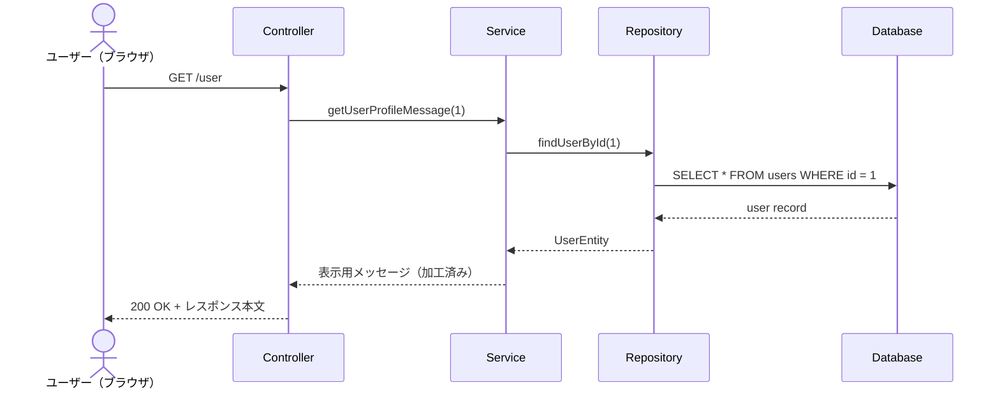

# 第5章：Spring Bootプロジェクトの構造と処理の流れ（どこに何を書くべきか）

現場のSpring Bootプロジェクトを開くと、何十、何百というファイルが存在します。しかし、恐れる必要はありません。**「すべてのファイルは、決められた役割ごとに、決められたフォルダ（パッケージ）に整理されている」** からです。

## この章でできるようになること

- Spring Bootプロジェクトの主要フォルダの役割を説明できる
- Controller / Service / Repository の責務を区別して実装先を判断できる
- 1リクエストの処理がどの順序で流れるかを追跡できる

## 1. 全体マップ（一般的なフォルダ構造）

プロジェクトの基本的なフォルダ構成は、世界中のSpring Boot開発者でほぼ統一されています。以下がその「地図」です。

```text
my-project/ (プロジェクトの一番上のフォルダ)
 │
 ├─ pom.xml (または build.gradle)
 │   ★超重要：「このシステムで使う外部の便利ツール（ライブラリ）のリスト」です。
 │   「Spring Webを使いたい」「データベース接続ツールを使いたい」とここに書くと、
 │   インターネットから自動でダウンロードしてきてくれます。
 │
 └─ src/main/
     ├─ resources/
     │   ├─ application.properties (または .yml)
     │   │   ★設定ファイル：データベースのパスワードや、システムのポート番号など、
     │   │   プログラムのコード（Java）とは分けて管理したい設定を書きます。
     │   │
     │   └─ templates/ や static/ (HTMLや画像ファイルなど、Viewの要素を置く場所)
     │
     └─ java/com/example/demo/ (★ここから下が、私たちがJavaのコードを書く主戦場です)
         │
         ├─ DemoApplication.java
         │   ★起動スイッチ：`@SpringBootApplication` という最強のふせんが貼られており、
         │   これをRunすると、第4章で学んだ「コンポーネントの大捜索とDI」が始まります。
         │
         ├─ controller/  (ウェイターの控室)
         ├─ service/     (キッチンの控室)
         ├─ repository/  (食材庫の管理者の控室)
         └─ entity/      (食材そのもの)
```

## 2. さらに進化した役割分担（レイヤードアーキテクチャ）

[**第3章**](03_web-and-mvc.md)で「MVC（Model・View・Controller）」を学びました。
Spring Bootの実務では、このうちの **「Model（裏側の処理すべて）」の部屋を、さらに3つの役割（層：レイヤー）に細かく分割** して作ります。

なぜさらに分けるのでしょうか？
もし「キッチン（Service）」の料理人が、いちいち「畑にじゃがいもを掘りに行く（データベースからデータを取ってくる）」作業までやっていたら、料理（複雑な計算）に集中できないからです。

そこで、以下の**4つの登場人物（クラス）のバケツリレー**で処理を進めるのがSpring Bootの黄金ルールです。

1.  **Controller（コントローラー層：ウェイター）**【ふせん：`@RestController`】
    - **役割**：ユーザー（ブラウザやスマホ）からのリクエストを受け取り、Serviceに仕事を依頼し、結果をユーザーに返すだけの「窓口」です。
    - **絶対やらないこと**：自分で複雑な計算をしたり、データベースに直接触ったりは絶対にしません。
2.  **Service（サービス層：キッチン・料理人）**【ふせん：`@Service`】
    - **役割**：システムの心臓部（ビジネスロジック）。「消費税を計算する」「パスワードが合っているかチェックする」などの複雑な処理を担当します。
    - **絶対やらないこと**：データベースに直接触るためのSQL（データベース専用の言語）などは書きません。
3.  **Repository（リポジトリ層：食材庫の管理者）**【ふせん：`@Repository`】
    - **役割**：データベース（DB）と直接やり取りをする専用のクラスです。「DBから鈴木さんのデータを取ってくる」「DBに新しいデータを保存する」ことだけを行います。
4.  **Entity と DTO（データの入れ物）**【ふせん不要】
    これらはどちらもデータを運ぶ「箱」ですが、明確に役割が異なります。ここを混同しないことがきれいな設計の第一歩です。
    - **Entity（エンティティ：食材そのもの）**：データベースの表（テーブル）の形をそのまま表した「永続化のためのモデル」です。RepositoryとDBの間でやり取りされます。
    - **DTO（データ転送オブジェクト：お皿に乗った完成料理）**：レイヤー間や、ユーザー（画面）にデータを渡すためだけに形を整えた「受け渡し専用のモデル」です。ServiceでEntityからDTOにデータを詰め替えて、Controllerを経由してユーザーへ返します。

## 3. 処理の流れ（バケツリレーの実況中継）

ユーザーが「自分のプロフィール画面を見たい！」とリクエストを送ってから、結果が返るまでの流れを追ってみましょう。

1.  **【リクエスト到着】** ユーザーのブラウザ ➔ `Controller`
2.  **【Controllerの仕事】** `Controller`は「お、プロフィールの依頼だな。おい`Service`、IDが1番のユーザーのプロフィール情報を準備してくれ！」と依頼します。
3.  **【Serviceの仕事】** `Service`は「ID1番ですね。でも私（料理人）はDBの中身を知りません。おい`Repository`、DBからID1番のデータ（食材）を取ってきてくれ！」と依頼します。
4.  **【Repositoryの仕事】** `Repository`はDBに接続し、ID1番のデータを見つけて `Entity`（データの箱）に詰め込み、`Service`に渡します。
5.  **【Serviceの仕事（続き）】** `Service`は受け取った `Entity` のデータを見て、「よし、年齢を計算して、見やすい形に整えよう」と加工（調理）し、`Controller`に渡します。
6.  **【Controllerの仕事（続き）】** `Controller`は受け取った完成品を、そのままユーザーのブラウザに「お待たせしました！」と返します（レスポンス）。

#### シーケンス図



図では「誰が誰に依頼し、どの順番で結果が戻るか」を表しています。コードを読む前にこの図を見ると、レイヤーの責務分担を追いやすくなります。

※このとき、**ControllerはServiceをDIで注入**されており、**ServiceはRepositoryをDIで注入**されています（[第4章](04_di-and-annotations.md)参照）。全員がDIで繋がっているからこそ、このバケツリレーがスムーズに成立するのです。

---

### 【サンプルコード】究極のバケツリレー（コピペで動く完全版）

上記の4つの登場人物が、どのようにDIで繋がり、データを渡していくのか。完全に動作するコードで確認してください。（※今回は本物のデータベースの代わりに、Repositoryの中に簡易的なデータを用意しています）。

> **【`package` 宣言について】** 以下のサンプルコードでは、各ファイルの先頭に `package com.example.demo.○○;` という記述が登場します。これは「このJavaファイルがどのフォルダ（パッケージ）に属するか」をJavaに伝えるための宣言で、Spring Bootプロジェクトでは必ず書きます。上のフォルダ構造図と照らし合わせると、どのフォルダのファイルかがよく分かります（例：`entity/` フォルダのファイル → `package com.example.demo.entity;`）。

**1. Entity（データの箱）: `User.java`**

```java
package com.example.demo.entity;

// データベースから取り出したデータを一時的に入れておく箱（ただのクラス）
public class User {
    private int id;
    private String name;

    public User(int id, String name) {
        this.id = id;
        this.name = name;
    }

    public int getId() { return id; }
    public String getName() { return name; }
}
```

**2. Repository（DB担当）: `UserRepository.java`**

```java
package com.example.demo.repository;
import com.example.demo.entity.User;
import org.springframework.stereotype.Repository;

@Repository // 「私はDB担当です！Springさん管理して！」というふせん
public class UserRepository {

    // DBからデータを取ってくる代わりの処理
    public User findUserById(int id) {
        // 本来はここでSQLを書いて本物のDBにアクセスしますが、今回は手作りで返します
        if (id == 1) {
            return new User(1, "鈴木一郎"); // DBから見つかった想定
        }
        return new User(id, "名無しさん");
    }
}
```

**3. Service（計算・加工担当）: `UserService.java`**

```java
package com.example.demo.service;
import com.example.demo.entity.User;
import com.example.demo.repository.UserRepository;
import org.springframework.stereotype.Service;

@Service // 「私は計算担当です！Springさん管理して！」というふせん
public class UserService {

    private final UserRepository userRepository;

    // ★DI：自分が働くために必要なRepositoryを、Springに注入してもらう！
    public UserService(UserRepository userRepository) {
        this.userRepository = userRepository;
    }

    // Controllerから呼ばれる処理
    public String getUserProfileMessage(int id) {
        // 1. Repositoryに頼んでDBからデータ（Entity）を取ってきてもらう
        User user = userRepository.findUserById(id);

        // 2. 取ってきたデータを元に、メッセージを組み立てる（ビジネスロジック）
        return "会員番号" + user.getId() + "番は、" + user.getName() + " 様です。";
    }
}
```

**4. Controller（窓口担当）: `UserController.java`**

```java
package com.example.demo.controller;
import com.example.demo.service.UserService;
import org.springframework.web.bind.annotation.GetMapping;
import org.springframework.web.bind.annotation.RestController;

@RestController // 「私はWebの窓口です！Springさん管理して！」というふせん
public class UserController {

    private final UserService userService;

    // ★DI：自分が働くために必要なServiceを、Springに注入してもらう！
    public UserController(UserService userService) {
        this.userService = userService;
    }

    // ブラウザから「/user」にアクセスが来た時の処理
    @GetMapping("/user")
    public String showUser() {
        // 窓口は自分では何もせず、Serviceに「ID1番のメッセージを作って！」と丸投げする
        String message = userService.getUserProfileMessage(1);

        // 出来上がったものをブラウザに返すだけ
        return message;
    }
}
```

**5. 起動スイッチ: `DemoApplication.java`**

```java
package com.example.demo;
import org.springframework.boot.SpringApplication;
import org.springframework.boot.autoconfigure.SpringBootApplication;

@SpringBootApplication // これが最強のふせん。ここからコンポーネントスキャンが始まる。
public class DemoApplication {
    public static void main(String[] args) {
        SpringApplication.run(DemoApplication.class, args);
    }
}
```

---

## 確証をとるためのテスト（第5章）

現場に入ったときに「エラーが起きたらどこを見るか」のアタリをつけるためのセルフチェックです。実際の調査手順を意識して答えてみてください。

**【問題1：レイヤーの役割当て】**  
新しい機能として「ユーザーが入力したパスワードが、8文字以上で英数字が含まれているかチェックする機能」を作ることになりました。
この処理は、`Controller`、`Service`、`Repository` のうち、どのクラス（層）のファイルに書くのが、Spring Bootのルールとして最も適切ですか？理由とともに答えてください。

**【問題2：エラーの調査（アタリをつける）】**  
あなたが現場に入って、先輩から「ユーザー一覧画面を開くと、画面に『データベースの接続に失敗しました』というエラーが出るから直して！」と頼まれました。
Spring Bootのフォルダ構造と役割分担を考えた時、あなたはまず、どのパッケージ（フォルダ）にある、何というアノテーション（ふせん）がついたファイルを重点的に調査しますか？

## <Next Step>

構造理解の次に取り組むと、実装品質と保守性を上げやすいテーマです。

> **補足コンテンツ**：この章のテーマに直結する内容として、[DTOとEntityの分離、Mapperの考え方](05-1_dto-entity-and-mapper.md) を用意しています。まずはこちらを読むと理解が繋がりやすくなります。

- **DTOとEntityの分離**：外部公開データとDBデータを分けて安全に設計する
- **Mapper（変換処理）**：層をまたぐデータ変換を整理して重複を減らす
- **ログ設計（SLF4J / Logback）**：障害調査しやすいログを最初から仕込む
- **ビルドと依存管理（Maven/Gradle）**：依存衝突を避ける実務的な管理方法

次に調べる用語は[第7章](07_next-step-keywords.md)にまとめています。

> **付録ハンズオン**：今回の章を実際に手を動かして確認したい場合は、[付録：Spring Bootハンズオン実践編（備品貸出管理アプリ）](08_appendix_equipment-lending-hands-on.md) に進んでください。H2付きの完全なサンプルコードで、Controller → Service → Repository の流れを追えます。

---

← [第4章に戻る](04_di-and-annotations.md)  |  → [補足：DTO/Entity/Mapper](05-1_dto-entity-and-mapper.md)  |  → [第6章へ進む](06_error-reading-and-qa.md)

